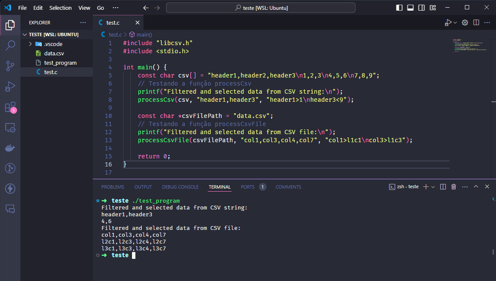

# Biblioteca CSV

## Descrição

Esta biblioteca (`libcsv.so`) foi desenvolvida em C para processar arquivos CSV ou strings de arquivos CSV, aplicando filtros e selecionando colunas conforme especificado. A biblioteca oferece duas funções principais:

1. `void processCsv(const char csv[], const char selectedColumns[], const char rowFilterDefinitions[])`
2. `void processCsvFile(const char csvFilePath[], const char selectedColumns[], const char rowFilterDefinitions[])`

A biblioteca pode ser utilizada para processar dados CSV diretamente de uma string ou de um arquivo, aplicando filtros e selecionando colunas conforme as necessidades do usuário.

## Funcionalidades

- ✅ Processamento de CSV a partir de uma string.
- ✅ Processamento de CSV a partir de um arquivo.
- ✅ Aplicação de filtros para seleção de linhas.
- ✅ Seleção de colunas específicas.
- ✅ Tratamento de erro para cabeçalhos e filtros inexistentes ou inválidos.
- ✅ Suporte para operadores de comparação: `>`, `<`, `=`, `!=`, `>=`, `<=`.
- ✅ Suporte para multiplos filtros para o mesmo header (cabeçalho).
- ✅ Testes para garantir funcionamento correto da biblioteca.

## Para utilizar a biblioteca primeiramente é necessário clonar o repositório

## Clonando o Repositório

Para clonar o repositório, execute o seguinte comando:

```sh
git clone <URL_DO_REPOSITORIO>
cd <NOME_DO_REPOSITORIO>
```

## Executando o Script de Build

O arquivo build.sh é um script que automatiza o processo de compilação, instalação e configuração da biblioteca compartilhada libcsv.so. Ele realiza várias etapas para garantir que a biblioteca e seus componentes estejam corretamente configurados no sistema. Abaixo está a descrição de cada etapa do script:

1. Atualiza o apt e instala o GCC e dependências necessárias: `sudo apt update` `sudo apt install`
2. Cria o diretório de build se não existir: `mkdir -p ./build/Debug`
3. Compila os arquivos fontes para criar a biblioteca compartilhada: `gcc -Wall -fPIC -c libcsv.c -o ./build/Debug/libcsv.o gcc -shared -o ./build/Debug/libcsv.so ./build/Debug/libcsv.o`
4. Compila os testes: `gcc -Wall -Wextra -Wpedantic -Wshadow -Wformat=2 -Wcast-align -Wconversion -Wsign-conversion -Wnull-dereference -g3 -O0 -c test_libcsv_all.c -o ./build/Debug/test_libcsv_all.o gcc -Wall -Wextra -Wpedantic -Wshadow -Wformat=2 -Wcast-align -Wconversion -Wsign-conversion -Wnull-dereference -g3 -O0 ./build/Debug/libcsv.o ./build/Debug/test_libcsv_all.o -o ./build/Debug/test_libcsv_all -lcunit -lpthread`
5. Copia a biblioteca compartilhada para /usr/local/lib: `sudo cp ./build/Debug/libcsv.so /usr/local/lib/`
6. Copia o arquivo de cabeçalho para /usr/local/include: `sudo cp libcsv.h /usr/local/include/`
7. Atualiza o cache das bibliotecas compartilhadas: `sudo ldconfig`
8. Configura a variável de ambiente LD_LIBRARY_PATH para incluir /usr/local/lib: `export LD_LIBRARY_PATH=/usr/local/lib:$LD_LIBRARY_PATH`

### Instruções Adicionais para Usuários do WSL (Windows Subsystem for Linux)

- Para usuários do WSL, todos os comandos e instruções acima são aplicáveis da mesma forma. No entanto, certifique-se de estar executando o WSL com privilégios de superusuário (root) quando necessário, especialmente ao instalar pacotes e copiar arquivos para diretórios do sistema (`/usr/local/lib` e `/usr/local/include`).

- 💡 Para executar o build automático execute o comando abaixo

```sh
./build.sh
```

- 💡 Para rodar os testes unitários execute o comando abaixo

```sh
./build/Debug/test_libcsv_all
```

- Após rodar o script de testes você deve ver uma tela parecida com essa:


### Seguindo essas instruções, você deve ser capaz de utilizar a biblioteca libcsv.so para processar arquivos CSV conforme necessário

1. Crie um projeto de testes qualquer e tente usar a biblioteca conforme a foto abaixo:


🚨 **Atenção**: Caso o passo acima tenha dado errado siga as instruções abaixo para realizar o procedimento manualmente

## Instalando Dependências Manualmente

🚨 **Atenção**: Certifique-se de estar na pasta raiz do repositório:

**exemplo:**

```sh
home/<seu_usuario>/<nome_do_repositorio>
```

1. Atualize o apt e instale o GCC e dependências necessárias:

```sh
sudo apt update
sudo apt install -y gcc libcunit1-dev make
```

2. Crie o diretório de build:

```sh
mkdir -p ./build/Debug
```

3. Compile os arquivos fontes para criar a biblioteca compartilhada:

```sh
gcc -Wall -fPIC -c libcsv.c -o ./build/Debug/libcsv.o
gcc -shared -o ./build/Debug/libcsv.so ./build/Debug/libcsv.o
```

4. Compile os testes:

```sh
gcc -Wall -Wextra -Wpedantic -Wshadow -Wformat=2 -Wcast-align -Wconversion -Wsign-conversion -Wnull-dereference -g3 -O0 -c test_libcsv_all.c -o ./build/Debug/test_libcsv_all.o
gcc -Wall -Wextra -Wpedantic -Wshadow -Wformat=2 -Wcast-align -Wconversion -Wsign-conversion -Wnull-dereference -g3 -O0 ./build/Debug/libcsv.o ./build/Debug/test_libcsv_all.o -o ./build/Debug/test_libcsv_all -lcunit -lpthread
```

5. Copie a biblioteca compartilhada e o arquivo de cabeçalho para os diretórios apropriados:

```sh
sudo cp ./build/Debug/libcsv.so /usr/local/lib/
sudo cp libcsv.h /usr/local/include/
sudo ldconfig
```

6. Defina a variável de ambiente LD_LIBRARY_PATH para incluir /usr/local/lib:

```sh
export LD_LIBRARY_PATH=/usr/local/lib:$LD_LIBRARY_PATH
```

7. Compile o seu programa de teste:

```sh
gcc -Wall -o ./build/Debug/test_program nome_do_seu_arquivo.c -lcsv -lpthread
```

8. Execute o seu programa com a biblioteca:

```sh
./build/Debug/test_program
```

- Exemplo de um programa de teste usando a biblioteca compartilhada libcsv.so



✅ Seguindo todas as instruções desse Readme você deve ser capaz de executar as funções processCsv e processCsvFile em seus projetos.

- 💡 Se você executou o passo a passo manualmente, você também pode executar os testes unitários através do comando abaixo.

```sh
./build/Debug/test_libcsv_all
```
